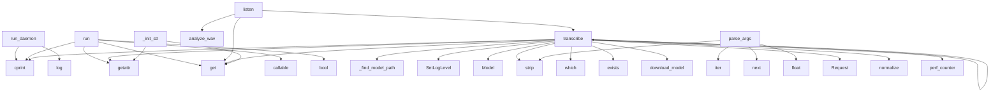

# System Architecture Analysis

## Overview

- **Project**: /home/tom/github/wronai/stts
- **Analysis Mode**: static
- **Total Functions**: 135
- **Total Classes**: 25
- **Modules**: 33
- **Entry Points**: 96

## Architecture by Module

### python.stts_core.shell
- **Functions**: 12
- **Classes**: 1
- **File**: `shell.py`

### python.stts_core.pipeline_helpers
- **Functions**: 12
- **Classes**: 1
- **File**: `pipeline_helpers.py`

### python.stts_core.providers.stt.whisper_cpp
- **Functions**: 11
- **Classes**: 1
- **File**: `whisper_cpp.py`

### python.stts_core.providers
- **Functions**: 9
- **Classes**: 2
- **File**: `__init__.py`

### examples.bench_metrics
- **Functions**: 8
- **File**: `bench_metrics.py`

### python.stts_core.providers.tts.piper
- **Functions**: 8
- **Classes**: 1
- **File**: `piper.py`

### python.stts_core.runtime
- **Functions**: 7
- **File**: `runtime.py`

### python.stts_core.config
- **Functions**: 7
- **File**: `config.py`

### bump_version
- **Functions**: 6
- **File**: `bump_version.py`

### python.stts_core.providers.stt.vosk
- **Functions**: 6
- **Classes**: 1
- **File**: `vosk.py`

### python.stts_core.nlp2cmd_client
- **Functions**: 4
- **File**: `nlp2cmd_client.py`

### python.stts_core.text
- **Functions**: 4
- **Classes**: 1
- **File**: `text.py`

### python.stts_core.providers.stt.faster_whisper
- **Functions**: 4
- **Classes**: 1
- **File**: `faster_whisper.py`

### python.stts_core.providers.stt.deepgram
- **Functions**: 3
- **Classes**: 1
- **File**: `deepgram.py`

### python.stts_core.providers.stt.coqui
- **Functions**: 3
- **Classes**: 1
- **File**: `coqui.py`

### python.stts_core.providers.stt.picovoice
- **Functions**: 3
- **Classes**: 1
- **File**: `picovoice.py`

### python.stts_core.shell_utils
- **Functions**: 3
- **Classes**: 2
- **File**: `shell_utils.py`

### python.stts_core.pipeline
- **Functions**: 3
- **Classes**: 3
- **File**: `pipeline.py`

### python.stts_core.registry
- **Functions**: 2
- **File**: `registry.py`

### python.stts_core.pipeline_utils
- **Functions**: 2
- **File**: `pipeline_utils.py`

## Key Entry Points

Main execution flows into the system:

### python.stts_core.shell.VoiceShell.run_daemon
- **Calls**: self.deps.cprint, log, log, log, log, list, log, log

### python.stts_core.shell.VoiceShell.run
- **Calls**: getattr, self.config.get, callable, bool, self.deps.cprint, print, print, print

### python.stts_core.providers.stt.vosk.VoskSTT.transcribe
- **Calls**: self._find_model_path, vosk.SetLogLevel, python.stts_core.shell_utils.cprint, vosk.Model, None.strip, _decode_with_grammar, python.stts_core.text.TextNormalizer.normalize, python.stts_core.shell_utils.cprint

### python.stts_core.shell.VoiceShell.listen
- **Calls**: self.config.get, self.deps.analyze_wav, self.transcribe, diag.get, self.config.get, self.deps.record_audio_vad, self.deps.record_audio, diag.get

### python.stts_core.providers.stt.whisper_cpp.WhisperCppSTT.transcribe
- **Calls**: shutil.which, shutil.which, shutil.which, model_path.exists, self.download_model, self._is_short_audio, None.strip, cmd.extend

### python.stts_core.cli.parse_args
- **Calls**: iter, next, next, float, None.strip, int, next, None.strip

### python.stts_core.providers.stt.deepgram.DeepgramSTT.transcribe
- **Calls**: None.strip, urllib.request.Request, python.stts_core.text.TextNormalizer.normalize, os.environ.get, None.strip, None.strip, None.strip, None.read_bytes

### python.stts_core.shell.VoiceShell.transcribe
- **Calls**: time.perf_counter, getattr, self.deps.cprint, self.stt.transcribe, os.environ.get, None.with_suffix, sidecar.exists, callable

### python.stts_core.shell.VoiceShell._init_stt
- **Calls**: self.config.get, getattr, cls.is_available, str, print, cls, bool, bool

### python.stts_core.providers.stt.whisper_cpp.WhisperCppSTT.download_model
- **Calls**: next, int, python.stts_core.shell_utils.cprint, model_path.parent.mkdir, python.stts_core.shell_utils.cprint, model_path.exists, urllib.request.urlretrieve, print

### python.stts_core.shell.VoiceShell.run_command_interactive
- **Calls**: pexpect.spawn, pexpect.spawn, child.close, None.join, print, output_parts.append, text.splitlines, child.expect

### python.stts_core.providers.stt.whisper_cpp.WhisperCppSTT.install
- **Calls**: python.stts_core.shell_utils.cprint, whisper_dir.mkdir, any, python.stts_core.shell_utils.cprint, None.lower, python.stts_core.shell_utils.cprint, p.exists, cls._has_gpu_build

### python.stts_core.runtime.load_dotenv
- **Calls**: candidates.append, candidates.append, candidates.append, None.resolve, None.splitlines, Path.cwd, line.strip, None.startswith

### python.stts_core.providers.tts.piper.PiperTTS.install_local
- **Calls**: cls._piper_asset_name, BIN_DIR.mkdir, python.stts_core.shell_utils.cprint, python.stts_core.shell_utils.cprint, urllib.request.urlretrieve, print, cls.find_piper_bin, python.stts_core.shell_utils.cprint

### python.stts_core.providers.tts.piper.PiperTTS.speak
- **Calls**: self.find_piper_bin, self._resolve_model, cfg.get, cfg.get, self._resolve_model, python.stts_core.shell_utils.cprint, python.stts_core.shell_utils.cprint, subprocess.run

### python.stts_core.providers.stt.faster_whisper.FasterWhisperSTT.transcribe
- **Calls**: os.environ.get, None.strip, os.environ.get, None.strip, WhisperModel, None.strip, None.strip, python.stts_core.text.TextNormalizer.normalize

### examples.bench_metrics.main
- **Calls**: None.lower, print, len, print, examples.bench_metrics.stats, print, None.strip, len

### python.stts_core.providers.tts.piper.PiperTTS.download_voice
- **Calls**: cls._parse_voice_id, out_dir.mkdir, python.stts_core.shell_utils.cprint, python.stts_core.shell_utils.cprint, python.stts_core.shell_utils.cprint, urllib.request.urlretrieve, print, python.stts_core.shell_utils.cprint

### python.stts_core.providers.stt.vosk.VoskSTT.download_model
- **Calls**: out_dir.mkdir, None.strip, urllib.request.urlretrieve, print, list, list, tempfile.NamedTemporaryFile, zipfile.ZipFile

### python.stts_core.providers.tts.piper.PiperTTS._resolve_model
- **Calls**: None.strip, None.expanduser, p2.exists, p.exists, p.is_file, Path, str, Path

### python.stts_core.providers.tts.coqui.CoquiTTS.speak
- **Calls**: None.lower, shutil.which, tempfile.NamedTemporaryFile, subprocess.run, CoquiTTSApi, tts.tts_to_file, None.unlink, python.stts_core.shell_utils.cprint

### python.stts_core.text.TextNormalizer._fix_phonetic_english
> Poprawia angielskie słowa techniczne zapisane fonetycznie po polsku.
- **Calls**: text.split, None.join, None.lower, re.match, m.groups, core.lower, cls.PHONETIC_EN_CORRECTIONS.get, fixed.append

### python.stts_core.text.TextNormalizer._fuzzy_phonetic_replacement
- **Calls**: functools.lru_cache, None.lower, difflib.get_close_matches, TextNormalizer.PHONETIC_EN_CORRECTIONS.get, s.isalpha, _rf_process.extractOne, TextNormalizer.PHONETIC_EN_CORRECTIONS.get, None.strip

### python.stts_core.providers.tts.rhvoice.RHVoiceTTS.speak
- **Calls**: shutil.which, shutil.which, python.stts_core.shell_utils.cprint, None.lower, subprocess.run, tempfile.NamedTemporaryFile, None.exists, python.stts_core.shell_utils.play_audio

### python.stts_core.shell.VoiceShell.__init__
- **Calls**: deps.detect_system, self._init_stt, self._init_tts, deps.HISTORY_FILE.parent.mkdir, deps.HISTORY_FILE.exists, atexit.register, deps.readline.read_history_file, bool

### python.stts_core.providers.tts.festival.FestivalTTS.speak
- **Calls**: None.lower, shutil.which, tempfile.NamedTemporaryFile, subprocess.run, subprocess.run, None.exists, python.stts_core.shell_utils.play_audio, None.unlink

### python.stts_core.providers.tts.espeak.EspeakTTS.speak
- **Calls**: shutil.which, shutil.which, python.stts_core.shell_utils.cprint, None.lower, subprocess.run, subprocess.run, getattr, python.stts_core.shell_utils.cprint

### python.stts_core.providers.stt.coqui.CoquiSTT.transcribe
- **Calls**: str, None.exists, python.stts_core.shell_utils.cprint, wave.open, wf.readframes, wf.close, Model, model.stt

### python.stts_core.config.load_config
- **Calls**: CONFIG_DIR.mkdir, DEFAULT_CONFIG.copy, python.stts_core.config.get_config_file_for_load, callable, path.exists, apply_env_overrides, cfg.update, cfg.update

### python.stts_core.pipeline_utils.expand_placeholders
- **Calls**: any, config.get, deps.argv_to_cmd, shell.tts.speak, contextlib.redirect_stdout, deps.cprint, None.replace, expanded.append

## Process Flows

Key execution flows identified:

### Flow 1: run_daemon
```
run_daemon [python.stts_core.shell.VoiceShell]
```

### Flow 2: run
```
run [python.stts_core.shell.VoiceShell]
```

### Flow 3: transcribe
```
transcribe [python.stts_core.providers.stt.vosk.VoskSTT]
  └─ →> cprint
```

### Flow 4: listen
```
listen [python.stts_core.shell.VoiceShell]
```

### Flow 5: parse_args
```
parse_args [python.stts_core.cli]
```

### Flow 6: _init_stt
```
_init_stt [python.stts_core.shell.VoiceShell]
```

### Flow 7: download_model
```
download_model [python.stts_core.providers.stt.whisper_cpp.WhisperCppSTT]
  └─ →> cprint
  └─ →> cprint
```

### Flow 8: run_command_interactive
```
run_command_interactive [python.stts_core.shell.VoiceShell]
```

### Flow 9: install
```
install [python.stts_core.providers.stt.whisper_cpp.WhisperCppSTT]
  └─ →> cprint
  └─ →> cprint
```

### Flow 10: load_dotenv
```
load_dotenv [python.stts_core.runtime]
```

## Key Classes

### python.stts_core.shell.VoiceShell
- **Methods**: 12
- **Key Methods**: python.stts_core.shell.VoiceShell.__init__, python.stts_core.shell.VoiceShell._init_stt, python.stts_core.shell.VoiceShell._init_tts, python.stts_core.shell.VoiceShell.speak, python.stts_core.shell.VoiceShell.transcribe, python.stts_core.shell.VoiceShell.listen, python.stts_core.shell.VoiceShell.run_command, python.stts_core.shell.VoiceShell.run_command_streaming, python.stts_core.shell.VoiceShell.run_command_any, python.stts_core.shell.VoiceShell.run_command_interactive

### python.stts_core.providers.stt.whisper_cpp.WhisperCppSTT
> Offline, fast, CPU-optimized Whisper (recommended).
- **Methods**: 11
- **Key Methods**: python.stts_core.providers.stt.whisper_cpp.WhisperCppSTT.is_available, python.stts_core.providers.stt.whisper_cpp.WhisperCppSTT.get_recommended_model, python.stts_core.providers.stt.whisper_cpp.WhisperCppSTT._detect_cuda, python.stts_core.providers.stt.whisper_cpp.WhisperCppSTT._has_gpu_build, python.stts_core.providers.stt.whisper_cpp.WhisperCppSTT.install, python.stts_core.providers.stt.whisper_cpp.WhisperCppSTT.download_model, python.stts_core.providers.stt.whisper_cpp.WhisperCppSTT._help_text, python.stts_core.providers.stt.whisper_cpp.WhisperCppSTT._is_short_audio, python.stts_core.providers.stt.whisper_cpp.WhisperCppSTT._supports_help_token, python.stts_core.providers.stt.whisper_cpp.WhisperCppSTT._detect_prompt_flag
- **Inherits**: STTProvider

### python.stts_core.providers.tts.piper.PiperTTS
> Piper TTS - fast, local neural TTS with Polish voices.
- **Methods**: 8
- **Key Methods**: python.stts_core.providers.tts.piper.PiperTTS.find_piper_bin, python.stts_core.providers.tts.piper.PiperTTS._piper_asset_name, python.stts_core.providers.tts.piper.PiperTTS.install_local, python.stts_core.providers.tts.piper.PiperTTS._parse_voice_id, python.stts_core.providers.tts.piper.PiperTTS.download_voice, python.stts_core.providers.tts.piper.PiperTTS.is_available, python.stts_core.providers.tts.piper.PiperTTS._resolve_model, python.stts_core.providers.tts.piper.PiperTTS.speak
- **Inherits**: TTSProvider

### python.stts_core.providers.stt.vosk.VoskSTT
> Offline, fast, lightweight STT (good for RPi).
- **Methods**: 6
- **Key Methods**: python.stts_core.providers.stt.vosk.VoskSTT.is_available, python.stts_core.providers.stt.vosk.VoskSTT.install, python.stts_core.providers.stt.vosk.VoskSTT.download_model, python.stts_core.providers.stt.vosk.VoskSTT.get_recommended_model, python.stts_core.providers.stt.vosk.VoskSTT._find_model_path, python.stts_core.providers.stt.vosk.VoskSTT.transcribe
- **Inherits**: STTProvider

### python.stts_core.providers.STTProvider
> Base class for STT (Speech-to-Text) providers.
- **Methods**: 5
- **Key Methods**: python.stts_core.providers.STTProvider.is_available, python.stts_core.providers.STTProvider.install, python.stts_core.providers.STTProvider.get_recommended_model, python.stts_core.providers.STTProvider.__init__, python.stts_core.providers.STTProvider.transcribe

### python.stts_core.providers.TTSProvider
> Base class for TTS (Text-to-Speech) providers.
- **Methods**: 4
- **Key Methods**: python.stts_core.providers.TTSProvider.is_available, python.stts_core.providers.TTSProvider.install, python.stts_core.providers.TTSProvider.__init__, python.stts_core.providers.TTSProvider.speak

### python.stts_core.providers.stt.faster_whisper.FasterWhisperSTT
> faster-whisper STT provider - CTranslate2-optimized Whisper.
- **Methods**: 4
- **Key Methods**: python.stts_core.providers.stt.faster_whisper.FasterWhisperSTT.is_available, python.stts_core.providers.stt.faster_whisper.FasterWhisperSTT.install, python.stts_core.providers.stt.faster_whisper.FasterWhisperSTT.get_recommended_model, python.stts_core.providers.stt.faster_whisper.FasterWhisperSTT.transcribe
- **Inherits**: STTProvider

### python.stts_core.text.TextNormalizer
> Normalizuje i koryguje tekst z STT dla poleceń shell.
- **Methods**: 3
- **Key Methods**: python.stts_core.text.TextNormalizer.normalize, python.stts_core.text.TextNormalizer._fix_phonetic_english, python.stts_core.text.TextNormalizer._fuzzy_phonetic_replacement

### python.stts_core.providers.stt.deepgram.DeepgramSTT
> Online STT (Deepgram REST).
- **Methods**: 3
- **Key Methods**: python.stts_core.providers.stt.deepgram.DeepgramSTT.is_available, python.stts_core.providers.stt.deepgram.DeepgramSTT.get_recommended_model, python.stts_core.providers.stt.deepgram.DeepgramSTT.transcribe
- **Inherits**: STTProvider

### python.stts_core.providers.stt.coqui.CoquiSTT
> Coqui STT - lightweight, CPU-friendly, good for Polish accents.
- **Methods**: 3
- **Key Methods**: python.stts_core.providers.stt.coqui.CoquiSTT.is_available, python.stts_core.providers.stt.coqui.CoquiSTT.get_recommended_model, python.stts_core.providers.stt.coqui.CoquiSTT.transcribe
- **Inherits**: STTProvider

### python.stts_core.providers.stt.picovoice.PicovoiceSTT
> Picovoice Leopard - ultra-lightweight STT for embedded.
- **Methods**: 3
- **Key Methods**: python.stts_core.providers.stt.picovoice.PicovoiceSTT.is_available, python.stts_core.providers.stt.picovoice.PicovoiceSTT.get_recommended_model, python.stts_core.providers.stt.picovoice.PicovoiceSTT.transcribe
- **Inherits**: STTProvider

### python.stts_core.providers.tts.rhvoice.RHVoiceTTS
> RHVoice - native Polish TTS, fast CPU.
- **Methods**: 2
- **Key Methods**: python.stts_core.providers.tts.rhvoice.RHVoiceTTS.is_available, python.stts_core.providers.tts.rhvoice.RHVoiceTTS.speak
- **Inherits**: TTSProvider

### python.stts_core.providers.tts.festival.FestivalTTS
> Festival TTS - classic, ultra-lightweight.
- **Methods**: 2
- **Key Methods**: python.stts_core.providers.tts.festival.FestivalTTS.is_available, python.stts_core.providers.tts.festival.FestivalTTS.speak
- **Inherits**: TTSProvider

### python.stts_core.providers.tts.coqui.CoquiTTS
> Coqui TTS - open-source neural TTS.
- **Methods**: 2
- **Key Methods**: python.stts_core.providers.tts.coqui.CoquiTTS.is_available, python.stts_core.providers.tts.coqui.CoquiTTS.speak
- **Inherits**: TTSProvider

### python.stts_core.providers.tts.espeak.EspeakTTS
> Espeak TTS - lightweight, multi-language speech synthesis.
- **Methods**: 2
- **Key Methods**: python.stts_core.providers.tts.espeak.EspeakTTS.is_available, python.stts_core.providers.tts.espeak.EspeakTTS.speak
- **Inherits**: TTSProvider

### python.stts_core.providers.tts.say.SayTTS
> macOS say command - built-in TTS.
- **Methods**: 2
- **Key Methods**: python.stts_core.providers.tts.say.SayTTS.is_available, python.stts_core.providers.tts.say.SayTTS.speak
- **Inherits**: TTSProvider

### python.stts_core.providers.tts.kokoro.KokoroTTS
> Kokoro-82M - new open-source, fast on CPU.
- **Methods**: 2
- **Key Methods**: python.stts_core.providers.tts.kokoro.KokoroTTS.is_available, python.stts_core.providers.tts.kokoro.KokoroTTS.speak
- **Inherits**: TTSProvider

### python.stts_core.providers.tts.flite.FliteTTS
> Flite TTS - lightweight, fast speech synthesis.
- **Methods**: 2
- **Key Methods**: python.stts_core.providers.tts.flite.FliteTTS.is_available, python.stts_core.providers.tts.flite.FliteTTS.speak
- **Inherits**: TTSProvider

### python.stts_core.providers.tts.spd_say.SpdSayTTS
> Speech Dispatcher TTS - system integration.
- **Methods**: 2
- **Key Methods**: python.stts_core.providers.tts.spd_say.SpdSayTTS.is_available, python.stts_core.providers.tts.spd_say.SpdSayTTS.speak
- **Inherits**: TTSProvider

### python.stts_core.pipeline.PipelineResult
> Result of pipeline execution.

Attributes:
    exit_code: Process exit code (0 = success)
    output
- **Methods**: 1
- **Key Methods**: python.stts_core.pipeline.PipelineResult.success

## Data Transformation Functions

Key functions that process and transform data:

### python.stts_core.runtime.output_format
- **Output to**: None.lower, None.strip, os.environ.get

### python.stts_core.config.normalize_config_format
- **Output to**: None.lower, v.strip

### python.stts_core.config.parse_simple_yaml
- **Output to**: None.splitlines, raw.strip, line.split, k.strip, v.strip

### python.stts_core.cli.parse_args
- **Output to**: iter, next, next, float, None.strip

### python.stts_core.providers.tts.piper.PiperTTS._parse_voice_id
- **Output to**: None.strip, v.split, None.join, v.endswith, len

## Public API Surface

Functions exposed as public API (no underscore prefix):

- `python.stts_core.shell.VoiceShell.run_daemon` - 110 calls
- `python.stts_core.shell.VoiceShell.run` - 86 calls
- `python.stts_core.providers.stt.vosk.VoskSTT.transcribe` - 71 calls
- `python.stts_core.pipeline_helpers.run_nlp2cmd_stdin_mode` - 49 calls
- `python.stts_core.pipeline_helpers.run_nlp2cmd_parallel_fastpath` - 32 calls
- `python.stts_core.shell.VoiceShell.listen` - 30 calls
- `python.stts_core.providers.stt.whisper_cpp.WhisperCppSTT.transcribe` - 30 calls
- `python.stts_core.cli.parse_args` - 29 calls
- `python.stts_core.providers.stt.deepgram.DeepgramSTT.transcribe` - 28 calls
- `python.stts_core.shell.VoiceShell.transcribe` - 27 calls
- `python.stts_core.providers.stt.whisper_cpp.WhisperCppSTT.download_model` - 26 calls
- `python.stts_core.pipeline_helpers.run_stt_stream_shell` - 24 calls
- `python.stts_core.shell_utils.detect_system` - 23 calls
- `python.stts_core.shell.VoiceShell.run_command_interactive` - 22 calls
- `python.stts_core.providers.stt.whisper_cpp.WhisperCppSTT.install` - 22 calls
- `python.stts_core.runtime.load_dotenv` - 21 calls
- `python.stts_core.providers.tts.piper.PiperTTS.install_local` - 21 calls
- `python.stts_core.providers.tts.piper.PiperTTS.speak` - 21 calls
- `python.stts_core.providers.stt.faster_whisper.FasterWhisperSTT.transcribe` - 21 calls
- `examples.bench_metrics.main` - 19 calls
- `python.stts_core.providers.tts.piper.PiperTTS.download_voice` - 17 calls
- `python.stts_core.providers.stt.vosk.VoskSTT.download_model` - 17 calls
- `python.stts_core.providers.tts.coqui.CoquiTTS.speak` - 16 calls
- `python.stts_core.pipeline_helpers.run_stt_file_placeholder_mode` - 16 calls
- `examples.bench_metrics.stats` - 15 calls
- `python.stts_core.config.dump_simple_yaml` - 15 calls
- `python.stts_core.config.parse_simple_yaml` - 14 calls
- `python.stts_core.providers.tts.rhvoice.RHVoiceTTS.speak` - 14 calls
- `python.stts_core.providers.tts.festival.FestivalTTS.speak` - 13 calls
- `python.stts_core.providers.tts.espeak.EspeakTTS.speak` - 13 calls
- `python.stts_core.providers.stt.coqui.CoquiSTT.transcribe` - 13 calls
- `python.stts_core.config.load_config` - 12 calls
- `python.stts_core.pipeline_utils.expand_placeholders` - 12 calls
- `python.stts_core.providers.tts.kokoro.KokoroTTS.speak` - 12 calls
- `python.stts_core.pipeline_helpers.run_stt_once` - 11 calls
- `bump_version.bump` - 9 calls
- `examples.bench_metrics.cer` - 9 calls
- `python.stts_core.providers.stt.picovoice.PicovoiceSTT.transcribe` - 9 calls
- `python.stts_core.pipeline_helpers.run_stt_file_default_mode` - 9 calls
- `bump_version.main` - 8 calls

## System Interactions

How components interact:



## Reverse Engineering Guidelines

1. **Entry Points**: Start analysis from the entry points listed above
2. **Core Logic**: Focus on classes with many methods
3. **Data Flow**: Follow data transformation functions
4. **Process Flows**: Use the flow diagrams for execution paths
5. **API Surface**: Public API functions reveal the interface

## Context for LLM

Maintain the identified architectural patterns and public API surface when suggesting changes.